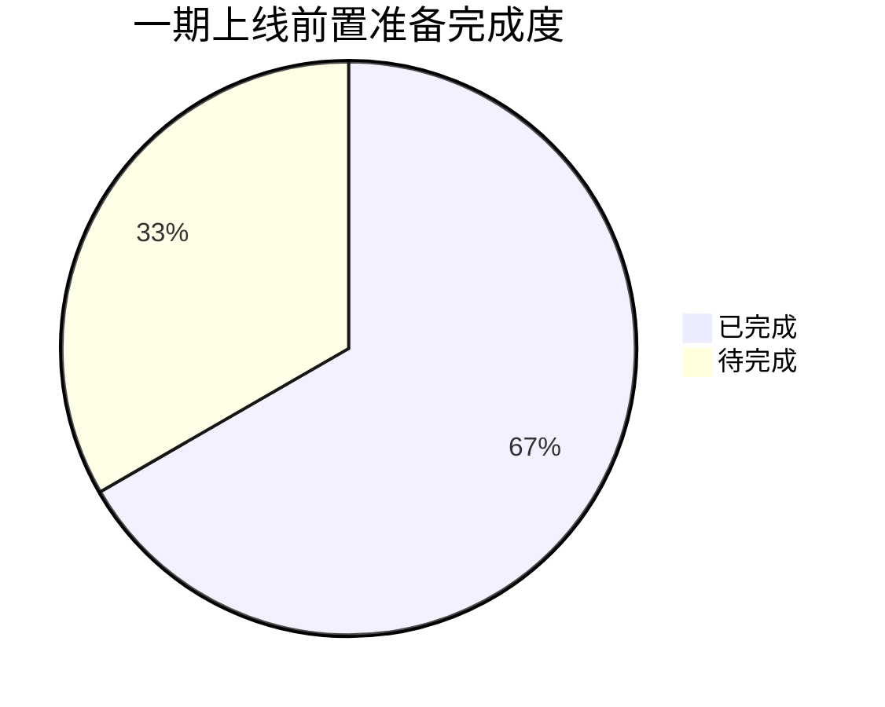

# 一期上线前置准备总清单

> 文档ID：S09-1 ｜ 生成时间：2026-08-15 ｜ 最后更新：2026-08-15（S10-1 新增部署操作指引）
> 基于 S06-1 巡检报告 + S06-2/S06-3/S07-1/S08-1 修复记录汇总

---

## 一、总览

### 1.1 分类统计

| 分类 | 已完成 | 待完成 | 总计 |
|------|--------|--------|------|
| 🔧 代码修复项 | 2 | 0 | 2 |
| 🌐 环境配置项 | 6 | 4 | 10 |
| 🔗 第三方渠道配置项 | 2 | 1 | 3 |
| ✅ **总计** | **10** | **5** | **15** |

### 1.2 完成进度



---

## 二、🔧 代码修复项（已完成）

| # | 项目 | 修复任务 | 完成时间 | 修复文件 |
|---|------|---------|----------|----------|
| 1 | `start_prod.sh` 端口硬编码 3001 | S06-2 | 2026-08-15 | `backend/start_prod.sh` — 改为从 `.env.production` 动态读取 `$PORT` |
| 2 | `deploy/.env` REDIS_PASSWORD 占位符 | S06-3 | 2026-08-15 | `deploy/.env` + `backend/.env.production` — 生成 43 位高复杂度密码 |

---

## 三、🌐 环境配置项

### 3.1 已完成

| # | 项目 | 配置位置 | 完成时间 | 说明 |
|---|------|---------|----------|------|
| 1 | JWT 密钥 | `backend/.env.production` | S04 | 86 字符，≥64 位合规 |
| 2 | CORS 域名 | `backend/.env.production` | S04 | `api.dftsh.top, admin.dftsh.top, dftsh.top` |
| 3 | CDN 域名 | `backend/.env.production` | S04 | `https://img.dftsh.top` |
| 4 | OBS 密钥 | `backend/.env.production` | S04 | AK/SK/Endpoint/Bucket 均已配置 |
| 5 | 微信小程序 AppID/Secret | `backend/.env.production` | S04 | `wx29f99563b733cc2a` |
| 6 | 小程序 manifest.json AppID | `miniprogram/src/manifest.json` | S04 | 正式 AppID 已配置 |

### 3.2 待完成

| # | 项目 | 配置位置 | 优先级 | 建议操作 |
|---|------|---------|--------|----------|
| 1 | **Sentry DSN（后端）** | `backend/.env.production` | P1 | 创建 Sentry 项目，获取 DSN 填入 `SENTRY_DSN`、`SENTRY_AUTH_TOKEN`、`SENTRY_ORG_SLUG`、`SENTRY_PROJECT_SLUG` |
| 2 | **Sentry DSN（Admin 前端）** | `admin/.env.production` | P1 | 填入 `VITE_SENTRY_DSN` |
| 3 | **Sentry DSN（小程序）** | `miniprogram/.env.production` | P1 | 填入 `VITE_SENTRY_DSN` |
| 4 | **Nginx 配置占位符替换** | `deploy/nginx/gaking.conf` | P1 | 替换 `{{API_DOMAIN}}` → `api.dftsh.top`、`{{ADMIN_DOMAIN}}` → `admin.dftsh.top`、`{{SSL_CERT}}` / `{{SSL_KEY}}` → 实际证书路径、`{{ADMIN_ROOT}}` → admin 静态文件目录 |

---

## 四、🔗 第三方渠道配置项

### 4.1 已完成

| # | 项目 | 配置值 | 说明 |
|---|------|--------|------|
| 1 | 喵有券 Token | `45d81d4d-890f-00fa-806a-89e3d8309b8d` | 已填入 `MIAO_QUAN_TOKEN` |
| 2 | 喵有券 PID | `mm_10429855609_3430050234_116303900384` | 已填入 `MIAO_QUAN_PID` |

### 4.2 待完成

| # | 项目 | 配置位置 | 优先级 | 说明 |
|---|------|---------|--------|------|
| 1 | **喵有券 API IP 白名单** | 喵有券后台 | **P1 阻塞** | 生产服务器公网 IP 需在喵有券后台配置白名单，否则订单拉取和商品搜索均会返回 `IP非法` |
| 2 | 订单侠 Token | `backend/.env.production` | P2 | 一期不对接，`ORDERX_TOKEN` 留空（已确认） |
| 3 | 大淘客 AppID/AppKey | `backend/.env.production` | P2 | 一期不对接，留空（已确认） |

---

## 五、🔧 其他待办项

### 5.1 数据库清理（可选）

| # | 项目 | 脚本路径 | 说明 |
|---|------|---------|------|
| 1 | 清理 growth 系统历史任务日志 | `docs/scripts/cleanup_growth_scheduled_task_logs.sql` | 清理 `scheduled_task_run_log` 表中 5 条 growth 残留记录 |
| 2 | 清理 growth 相关数据表 | 手动执行 | 确认 `gaking_member_level`、`gaking_member_growth_log`、`gaking_growth_task_rule` 等表已删除 |

### 5.2 生产部署验证

| # | 项目 | 说明 | 前置条件 |
|---|------|------|----------|
| 1 | 服务器安装 Docker | 执行 `docker compose up -d --build` | 服务器已就绪 |
| 2 | 健康检查验证 | 验证 `/healthz`、`/readyz`、`/metrics` | Docker 启动后 |
| 3 | 喵有券全链路验证 | 商品同步 → 订单拉取 → 佣金结算 → 提现 | IP 白名单已配置 |
| 4 | 小程序提交审核 | 上传代码包至微信公众平台 | 小程序前端已构建 |

---

## 六、上线前操作步骤

### Step 1：服务器环境准备（预计 30 分钟）

> 详细操作步骤请参考 [生产服务器部署操作指引.md](deployment/生产服务器部署操作指引.md)

```bash
# 1. 安装 Docker 和 docker-compose
# 2. 克隆代码仓库
git clone <repo_url>
cd GAKing-Coding

# 3. 配置环境变量
cp deploy/.env.example deploy/.env
# 编辑 deploy/.env，填入 REDIS_PASSWORD
# 编辑 backend/.env.production，填入 Sentry DSN
# 编辑 admin/.env.production，填入 Sentry DSN
# 编辑 miniprogram/.env.production，填入 Sentry DSN

# 4. 替换 Nginx 配置占位符
cp deploy/nginx/gaking.conf deploy/nginx/gaking.conf.prod
# 编辑 gaking.conf.prod，替换所有 {{xxx}} 占位符
```

### Step 2：Docker 启动（预计 5 分钟）

```bash
cd deploy
docker compose up -d --build
# 等待健康状况
docker compose ps
# 查看启动日志
docker compose logs -f backend
```

### Step 3：健康检查（预计 2 分钟）

```bash
# 后端健康检查
curl http://localhost:3003/healthz
curl http://localhost:3003/readyz
# 管理后台访问
curl http://localhost:8080/
```

### Step 4：渠道配置（预计 10 分钟）

```bash
# 1. 在喵有券后台配置服务器 IP 白名单
# 2. 后台登录验证商品同步和订单拉取
```

### Step 5：小程序发布（预计 1 天审核）

```bash
# 构建小程序
cd miniprogram
npm run build:mp-weixin
# 上传至微信公众平台，提交审核
```

---

## 七、归档文件清单

归档目录：`docs/release_v1/`

| 子目录 | 文件数 | 内容 |
|--------|--------|------|
| `self-tests/` | 12 份 | 所有模块自测记录 |
| `fixes/` | 4 份 | 端口修复、Redis 密码修复、缺陷台账、Bug 修复台账 |
| `deployment/` | 4 份 | 环境配置巡检、运维台账、线上巡检台账、**生产服务器部署操作指引** |
| `scripts/` | 2 份 | 清理 SQL 脚本 + 原始 SQL 脚本目录 |
| 根目录 | 2 份 | 本清单 + 交付归档说明 |